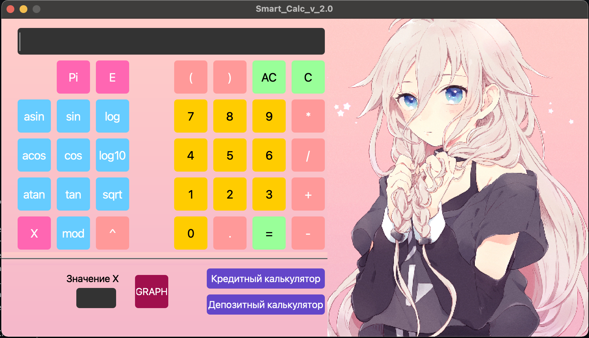
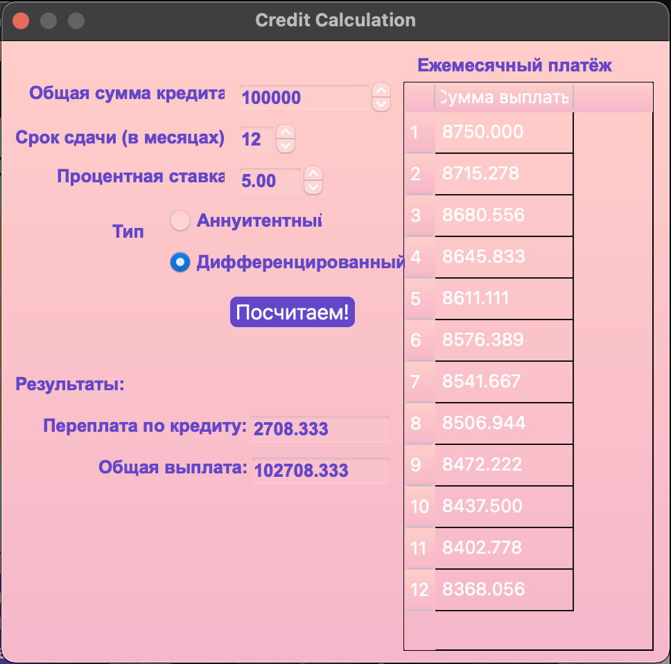

# SmartCalc v2.0

Implementation of SmartCalc v2.0.
Project date: 08-2023

## Description

This project implements in C++ programming language in the paradigm of object-oriented programming an extended version of a regular calculator that implements the same functions as the previously developed application in SmartCalc v1.0. This project uses a third-party library for expression validation [exptrk](https://www.partow.net/programming/exprtk/), library [qcustomplot](https://www.qcustomplot.com/) for graphing.  
The `pattern MVC` - Model, View, Controller was chosen as the project structure.

## Project Build

The project is built with the `make` command in the `src` folder, there are the following purposes:  
- `install` - install the application in the build folder,  
- `uninstall` - uninstallation,  
- `dvi` - opening help,  
- `dist` - archiving the project,  
- `gcov_report` - view test coverage (lcov utility is required),  
- `to_style` - converting code to clang-format style,  
- `style` - check code for style,  
- `valgrind` - check for leaks with valgrind utility,  
- `leaks` - check for leaks with the leaks utility on Mac OS,  
- `docker_check` - leak check and testing via docker in ubuntu environment  
- `rebuild` - rebuild the project,  
- `clean` - clean the project from temporary files.

## Implementation of SmartCalc v2.0

- The program is developed in C++ language of C++17 standard
- The program code should be located in the src folder
- Google Style is followed when writing the code
- Classes are implemented inside `s21` namespace
- Unit-test coverage of modules related to expression calculation is prepared with the help of GTest library.
- The program assembly should be configured using a Makefile with the standard set of targets for GNU programs: all, install, uninstall, clean, dvi, dist, tests.
- Implementation with graphical user interface, based on QT version 6.2.3
- The program is implemented using the MVC pattern
- Both integers and real numbers can be input to the program, written both in dot and exponential form.
- Calculation is performed after fully entering the expression to be calculated and pressing the `=` symbol.
- Plotting the graph of a function given using an expression in infix notation with the variable _x_ 
- Verifiable accuracy of the fractional part - at least 7 decimal places
- The user has the option to enter up to 255 characters
- Stapled arithmetic expressions in infix notation must support the following arithmetic operations and math functions:
-     **Arithmetic operators**:
     | Operator name | Infix notation   (Classic) |
      | --------- | ------ |
      | Brackets | (a + b) |
      | Addition | a + b |
      | Subtraction | a - b |
      | Multiplication | a * b |
      | Division | a / b |
      | Power | a ^ b |
      | Modulus | a mod b |
      | Unary plus | +a |
      | Unary minus | -a |

   - **Functions**:
      | Function description | Function |
      | ------ | ------ |
      | Computes cosine | cos(x) |
      | Computes sine | sin(x) |
      | Computes tangent | tan(x) |
      | Computes arc cosine | acos(x) |
      | Computes arc sine | asin(x) |
      | Computes arc tangent | atan(x) |
      | Computes square root | sqrt(x) |
      | Computes natural logarithm | ln(x) |
      | Computes common logarithm | log(x) |

   
  

## Credit Calculator

A special mode "loan calculator" is provided:
 - Input: total loan amount, term, interest rate, type (annuity, differentiated)
 - Output: monthly payment, loan overpayment, total payment  
  

## Deposit Calculator

Provided "deposit yield calculator" :
 - Input: deposit amount, deposit term, interest rate, tax rate, payment frequency, interest capitalization, list of replenishments, list of partial withdrawals
 - Exit: accrued interest, tax amount, amount on deposit at the end of the term.  
 