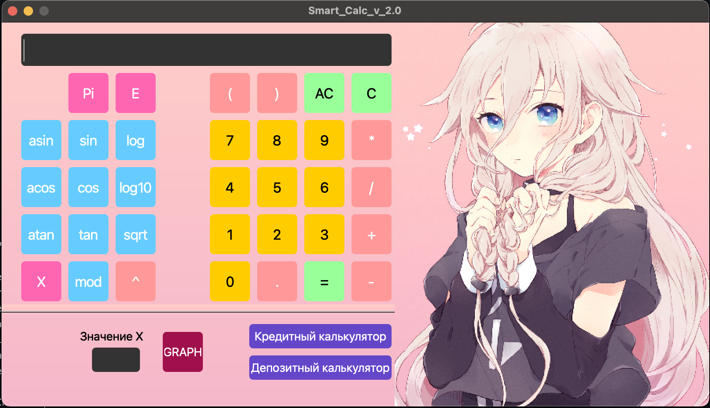
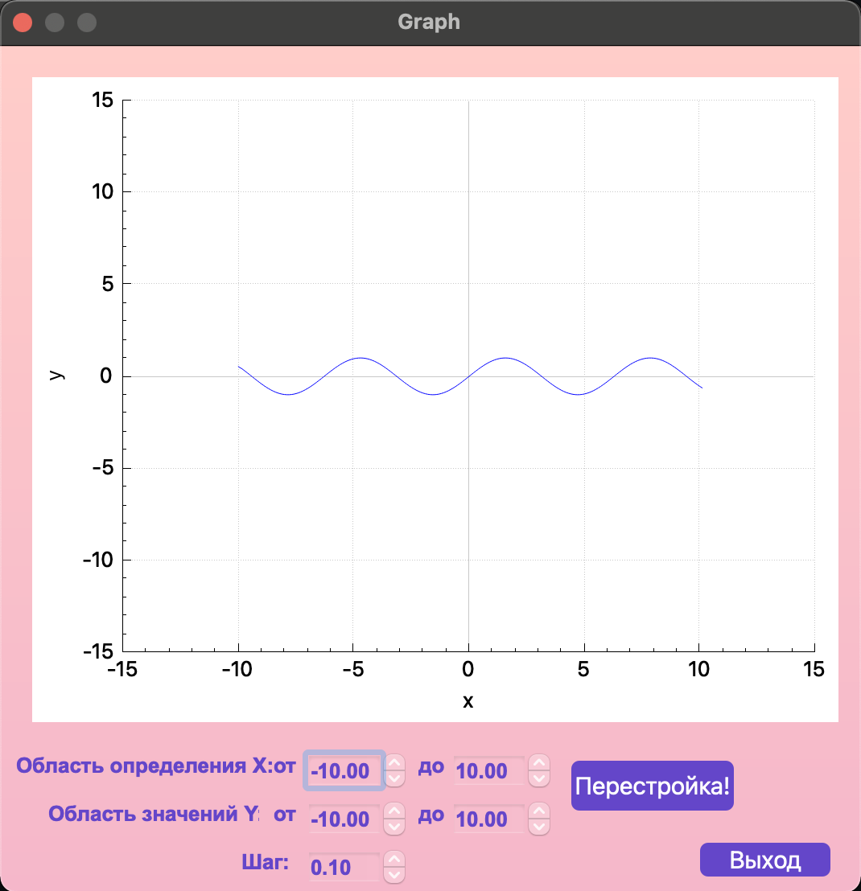
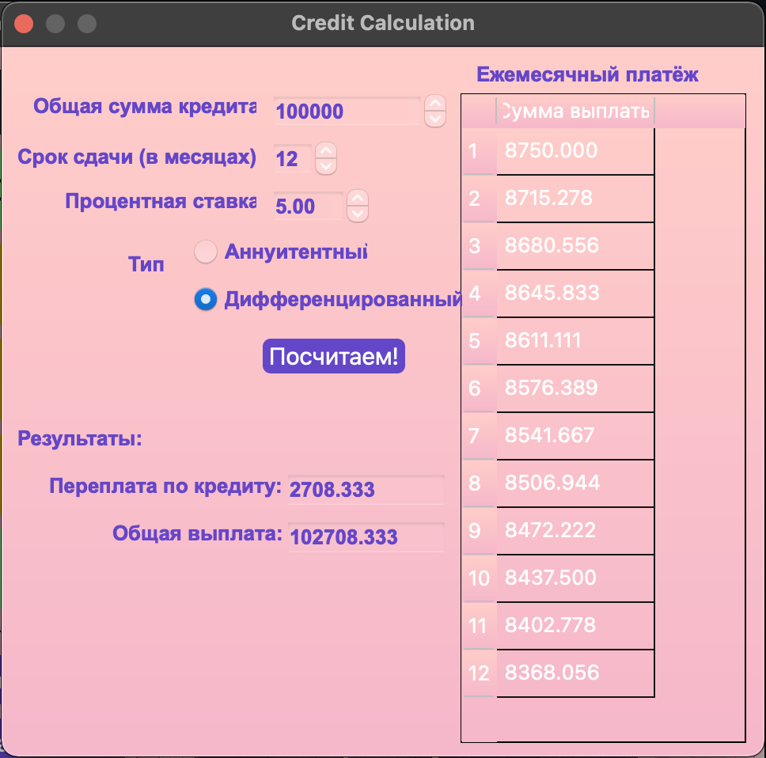
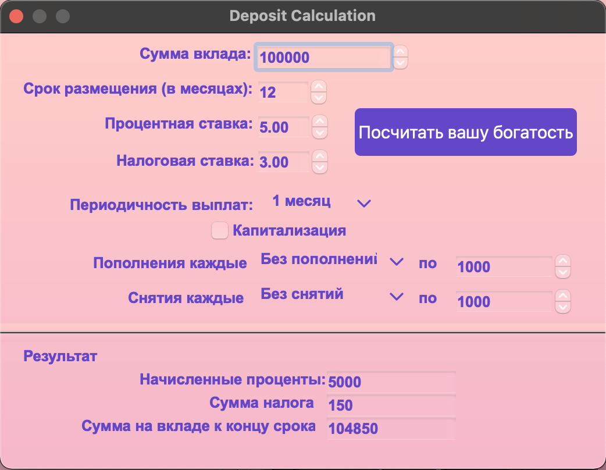

# SmartCalc v2.0

Реализация SmartCalc v2.0.
Project date: 08-2023

## Описание

В данном проекте реализован на языке программирования С++ в парадигме объектно-ориентированного программирования расширенная версия обычного калькулятора, реализующую те же самые функции, что и разработанное ранее приложение в проекте SmartCalc v1.0. В этом проекте использована сторонняя библиотека для валидации выражений [exptrk](https://www.partow.net/programming/exprtk/), библиотека [qcustomplot](https://www.qcustomplot.com/) для построения графиков.  
В качестве структуры проекта был выбран `паттерн MVC` - Model, View, Controller.

## Project Build

Сборка проекта осуществляется командой `make` в папке `src`, существуют следующие цели:  
- `install` - установка приложения в папку build,  
- `uninstall` - деинсталляция,  
- `dvi` - открытие справки,  
- `dist` - архивирование проекта,  
- `gcov_report` - просмотр покрытия тестов (необходима утилита lcov),  
- `to_style` - приведение кода к стилю clang-format,  
- `style` - проверка кода на стиль,  
- `valgrind` - проверка на утечки утилитой valgrind,  
- `leaks` - проверка на утечки утилитой leaks на Mac OS,  
- `docker_check` - проверка на утечки и тестирование через docker в среде ubuntu  
- `rebuild` - пересобрать проект,  
- `clean` - очистить проект от временных файлов.

## Реализация SmartCalc v2.0

- Программа разработана на языке C++ стандарта C++17
- Код программы должен находиться в папке src
- При написании кода соблюдён Google Style
- Классы реализованы внутри пространства имен `s21`
- Подготовлено покрытие unit-тестами модулей, связанных с вычислением выражений, c помощью библиотеки GTest
- Сборка программы должна быть настроена с помощью Makefile со стандартным набором целей для GNU-программ: all, install, uninstall, clean, dvi, dist, tests.
- Реализация с графическим пользовательским интерфейсом, на базе QT версии 6.2.3
- Программа реализована с использованием паттерна MVC
- На вход программы могут подаваться как целые числа, так и вещественные числа, записанные и через точку, и в экспоненциальной форме записи
- Вычисление производится после полного ввода вычисляемого выражения и нажатия на символ `=`
- Построение графика функции, заданной с помощью выражения в инфиксной нотации с переменной _x_ 
- Проверяемая точность дробной части - минимум 7 знаков после запятой
- У пользователя есть возможность ввода до 255 символов
- Скобочные арифметические выражения в инфиксной нотации должны поддерживать следующие арифметические операции и математические функции:
    - **Арифметические операторы**:

        | Название оператора | Инфиксная нотация   (Классическая) |
        | ------ | ------ |
        | Скобки | (a + b) |
        | Сложение | a + b |
        | Вычитание | a - b |
        | Умножение | a * b |
        | Деление | a / b |
        | Возведение в степень | a ^ b |
        | Остаток от деления | a mod b |
        | Унарный плюс | +a |
        | Унарный минус | -a |

    - **Функции**:
  
        | Описание функции | Функция |   
        | ---------------- | ------- |  
        | Вычисляет косинус | cos(x) |   
        | Вычисляет синус | sin(x) |  
        | Вычисляет тангенс | tan(x) |  
        | Вычисляет арккосинус | acos(x) | 
        | Вычисляет арксинус | asin(x) | 
        | Вычисляет арктангенс | atan(x) |
        | Вычисляет квадратный корень | sqrt(x) |
        | Вычисляет натуральный логарифм | ln(x) | 
        | Вычисляет десятичный логарифм | log(x) |

   
  

##  Кредитный калькулятор

Предусмотрен специальный режим "кредитный калькулятор":
 - Вход: общая сумма кредита, срок, процентная ставка, тип (аннуитетный, дифференцированный)
 - Выход: ежемесячный платеж, переплата по кредиту, общая выплата  
  

## Депозитный калькулятор

Предусмотрен "калькулятор доходности вкладов" :
 - Вход: сумма вклада, срок размещения, процентная ставка, налоговая ставка, периодичность выплат, капитализация процентов, список пополнений, список частичных снятий
 - Выход: начисленные проценты, сумма налога, сумма на вкладе к концу срока  
  
